# ThreadTruth Studio

[English](README.md) | [简体中文](README.zh-CN.md)

**Source-faithful fashion portrait production for Codex**

ThreadTruth Studio is an independent, community-maintained Codex Plugin. It reads visible facts from real single-garment or coordinated-outfit photos, routes among 24 style packs, waits for explicit approval before paid image generation, and governs a six-image delivery with commercial QA. For an outfit, it preserves each garment plus the visible layering, proportions, shoes, bag and accessory relationships rather than restyling the look. It is not an OpenAI product or endorsement.


This accepted beta.4 direction preview keeps one complete look—beige blazer, white top, dark denim, olive tote and brown loafers—consistent across six poses. It is a preview sheet, not six independent finals. [Browse all 24 outfit styles](docs/demo/style-previews/beige-blazer-denim-outfit-24-v1/index.html) · [Media rights](docs/demo/RIGHTS.md)

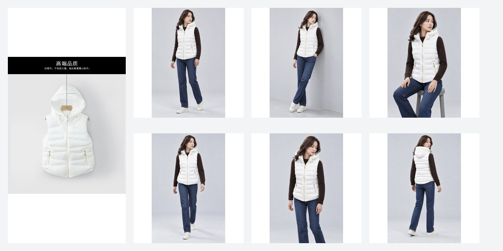

The white-vest example remains the complete, rights-cleared source-to-six-result case: four photos of one garment produced six independent Korean Cold Editorial B1 images, with SHA-256 records and closed human review. [Open the complete case](docs/demo/primary-cases/white-hooded-puffer-vest-korean-cold/README.md)

## Install and try recognition

Download the Plugin ZIP and its separate checksum from the [`v1.0.0-beta.4` Release](https://github.com/2278091160dg-rgb/threadtruth-studio/releases/tag/v1.0.0-beta.4). beta.1–beta.3 remain immutable. New-host CLI activation remains a separately disclosed compatibility gap. Follow the complete matching [installation guide](docs/INSTALL.md).

After installation, start a **new Codex task**, upload a garment image first, then enter exactly:

```text
请用 $threadtruth-studio 识别并推荐风格，不要生图
```

Expected: a garment recognition card, primary and alternative recommendations, and the full 24-style catalogue. This prompt does **not** authorize image generation.

Installed it? Share a sanitized result through the [installation feedback form](https://github.com/2278091160dg-rgb/threadtruth-studio/issues/new?template=installation-feedback.yml). Use [GitHub Issues](https://github.com/2278091160dg-rgb/threadtruth-studio/issues) for bugs or [Discussions](https://github.com/2278091160dg-rgb/threadtruth-studio/discussions) for questions. Do not post private garments, customer data, credentials, or full logs. Maintainer: [DENGGUI](https://github.com/2278091160dg-rgb) · WeChat: `Lvmusic0930`.

## What is public today

- Independent six-final coverage: `1/24`, the real case above.
- Single-style preview coverage: **two 24/24 collections are machine-layout checked, maintainer accepted and published in beta.4**: the frozen white vest and the coordinated beige-blazer outfit. Each style has an optimized native sheet, a labeled `1200×1200` display derivative and a whole-board thumbnail. Corrections and failed retries retain hash-bound lineage without publishing private working paths. These are AI-generated direction previews, not independent finals. Full counts and remaining gates: [work register](docs/WORK-STATUS.md).
- Gendered and culturally named styles translate atmosphere, styling language, lighting, and setting only. They never infer identity, ethnicity, nationality, body, or gender from the garment or wearer.

[Browse the 24-style evidence index](docs/demo/STYLES.md). A six-tile board is a direction preview, not six independent finals and not a completed workflow.

Two bounded demonstrations are maintained separately:

- **single garment · 24 styles** — the published white-vest beta.3 collection remains the sole representative source for the style index and gallery below;
- **coordinated outfit · 24 styles** — the authorized beige-blazer, white-top, dark-denim, olive-tote and brown-loafer [beta.4 collection](docs/demo/style-previews/beige-blazer-denim-outfit-24-v1/index.html) is published under `ThreadTruth-Demo-Only-1.0` with 24/24 approval.

These two examples demonstrate the governed workflows; they do not prove universal garment or outfit coverage and do not count as non-maintainer adoption or additional complete primary cases.

In ChatGPT, use the Plugin picker or `@threadtruth-studio`. On supported Codex surfaces, use the skill picker or `$threadtruth-studio`; in Codex CLI, inspect `/skills`. This project is not claiming an official marketplace listing.

<!-- STYLE_PREVIEWS:START -->

| | | | |
|---|---|---|---|
| <a href="docs/demo/style-previews/white-vest-24-v1/american-street-display.jpg">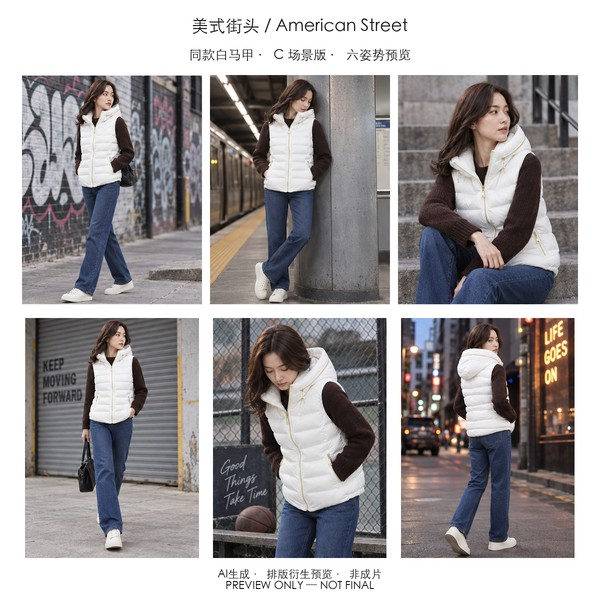</a><br>American Street | <a href="docs/demo/style-previews/white-vest-24-v1/athleisure-display.jpg">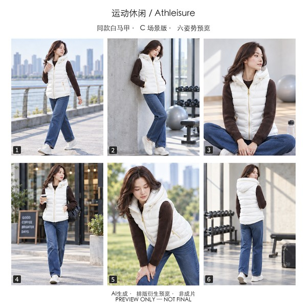</a><br>Athleisure | <a href="docs/demo/style-previews/white-vest-24-v1/balletcore-display.jpg">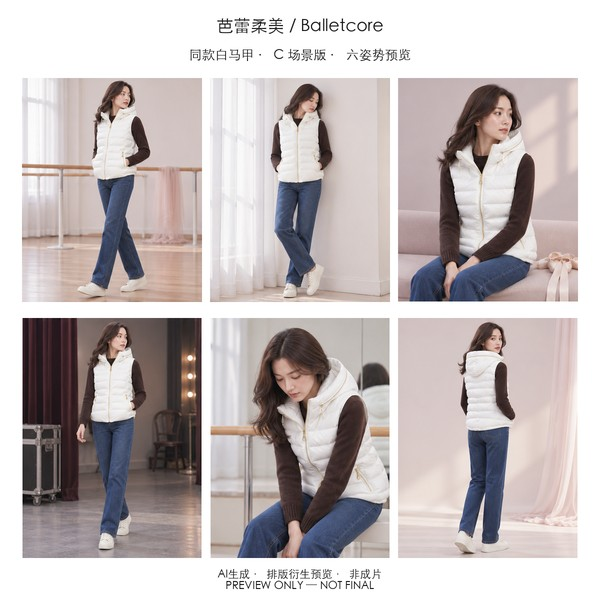</a><br>Balletcore | <a href="docs/demo/style-previews/white-vest-24-v1/british-heritage-display.jpg">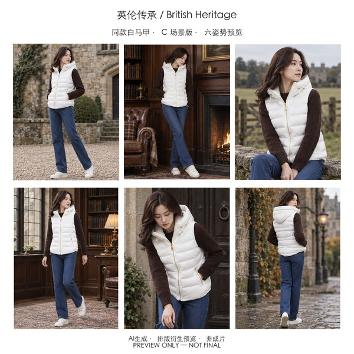</a><br>British Heritage |
| <a href="docs/demo/style-previews/white-vest-24-v1/cityboy-display.jpg">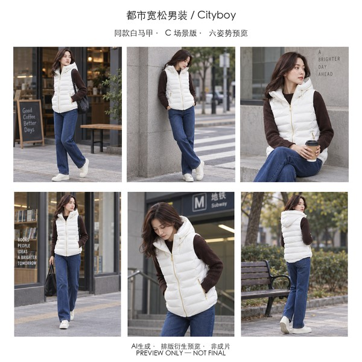</a><br>Cityboy | <a href="docs/demo/style-previews/white-vest-24-v1/clean-fit-display.jpg">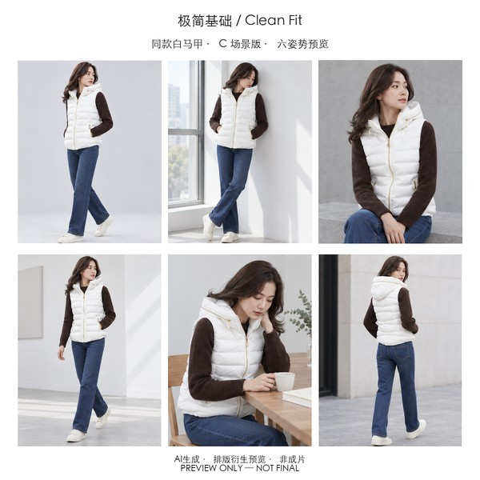</a><br>Clean Fit | <a href="docs/demo/style-previews/white-vest-24-v1/coquette-ladylike-display.jpg">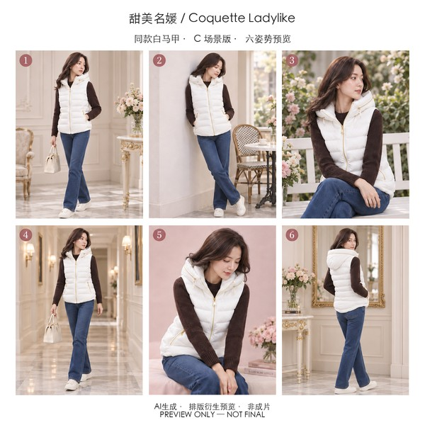</a><br>Coquette Ladylike | <a href="docs/demo/style-previews/white-vest-24-v1/ecommerce-studio-display.jpg">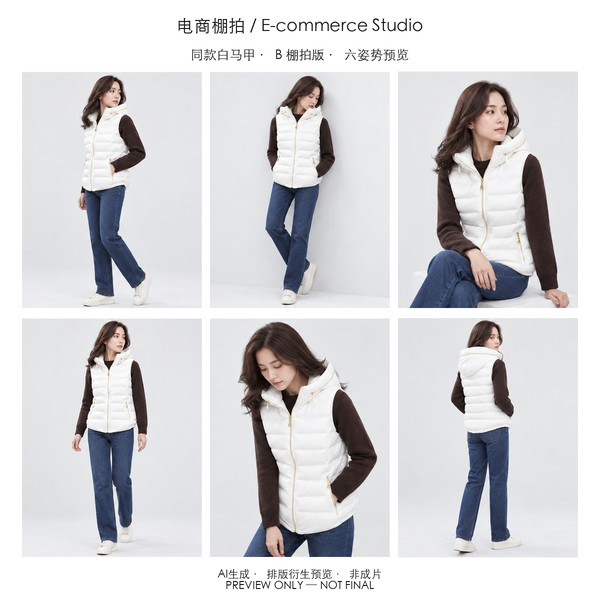</a><br>E-commerce Studio |
| <a href="docs/demo/style-previews/white-vest-24-v1/french-effortless-display.jpg">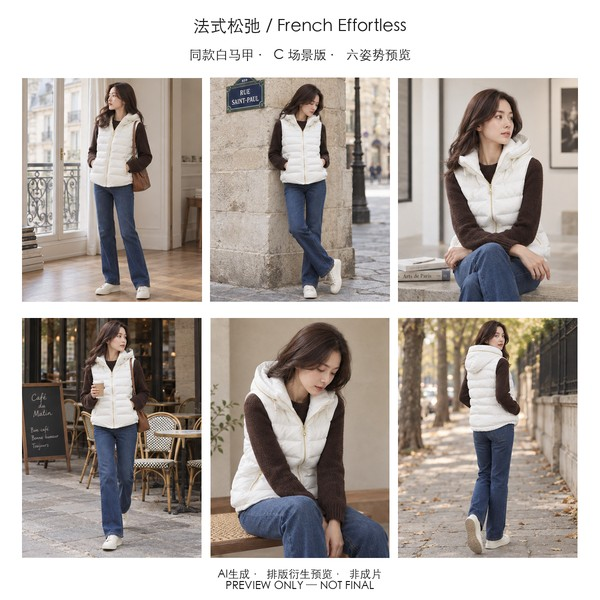</a><br>French Effortless | <a href="docs/demo/style-previews/white-vest-24-v1/gorpcore-display.jpg">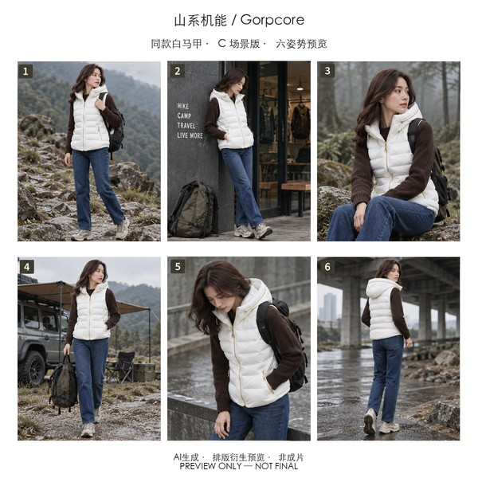</a><br>Gorpcore | <a href="docs/demo/style-previews/white-vest-24-v1/guochao-street-display.jpg">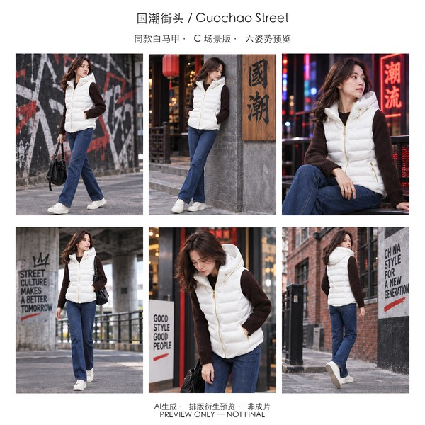</a><br>Guochao Street | <a href="docs/demo/style-previews/white-vest-24-v1/italian-luxe-display.jpg">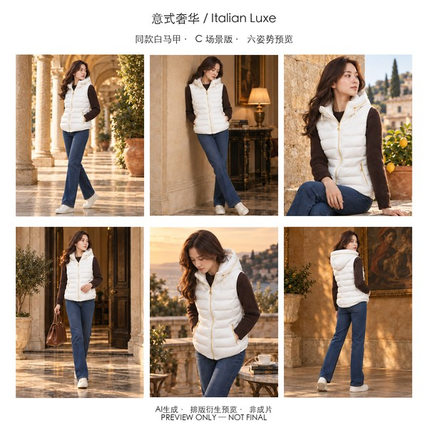</a><br>Italian Luxe |
| <a href="docs/demo/style-previews/white-vest-24-v1/japanese-lifestyle-display.jpg">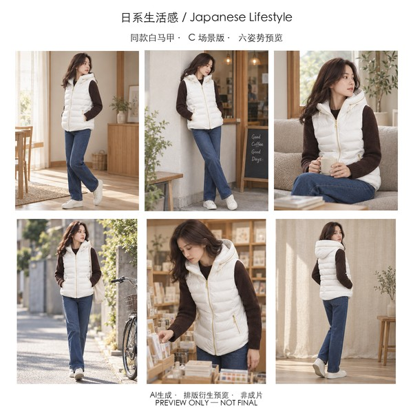</a><br>Japanese Lifestyle | <a href="docs/demo/style-previews/white-vest-24-v1/korean-cold-editorial-display.jpg">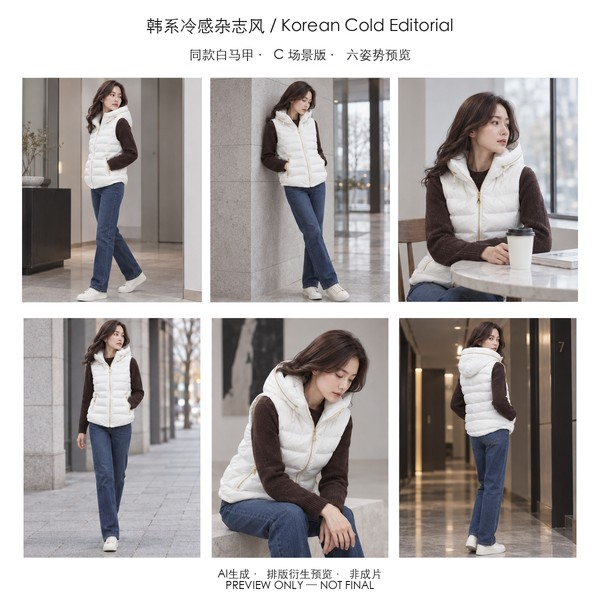</a><br>Korean Cold Editorial | <a href="docs/demo/style-previews/white-vest-24-v1/korean-menswear-display.jpg">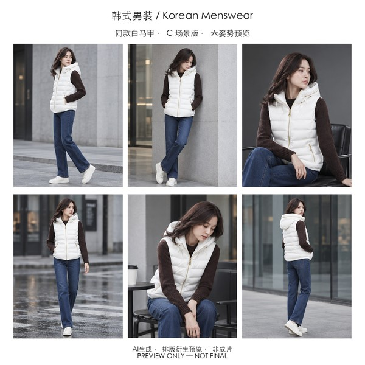</a><br>Korean Menswear | <a href="docs/demo/style-previews/white-vest-24-v1/neo-chinese-display.jpg">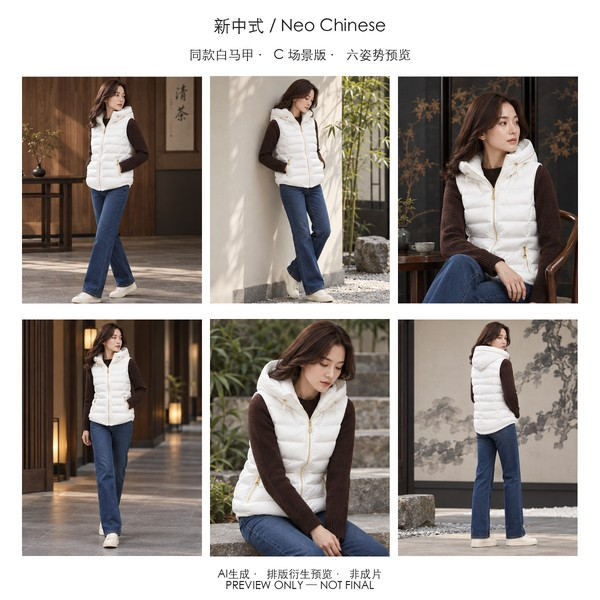</a><br>Neo Chinese |
| <a href="docs/demo/style-previews/white-vest-24-v1/nordic-minimal-display.jpg">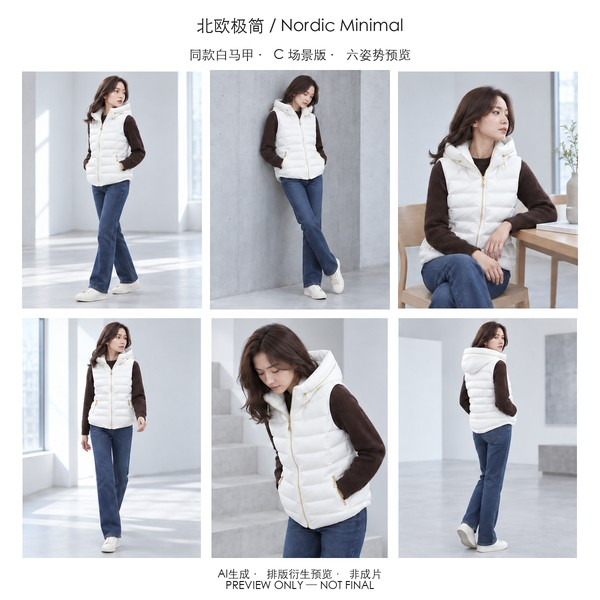</a><br>Nordic Minimal | <a href="docs/demo/style-previews/white-vest-24-v1/office-commute-women-display.jpg">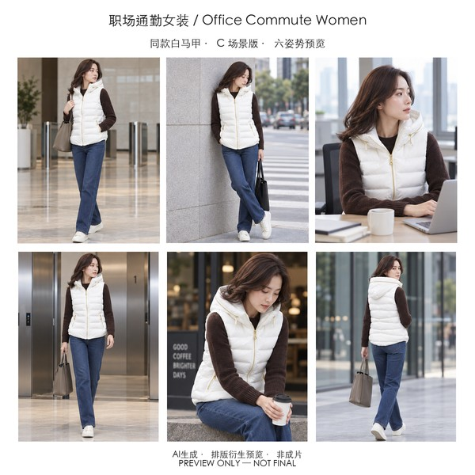</a><br>Office Commute Women | <a href="docs/demo/style-previews/white-vest-24-v1/old-money-display.jpg">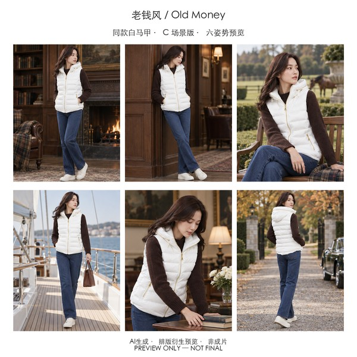</a><br>Old Money | <a href="docs/demo/style-previews/white-vest-24-v1/preppy-display.jpg">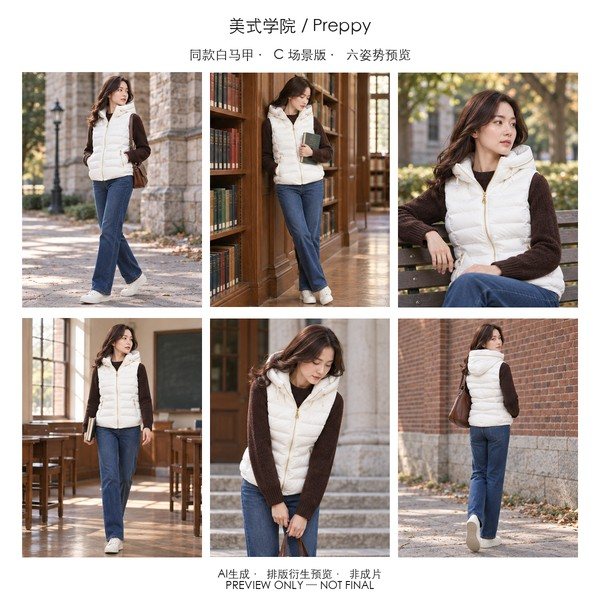</a><br>Preppy |
| <a href="docs/demo/style-previews/white-vest-24-v1/quiet-luxury-display.jpg">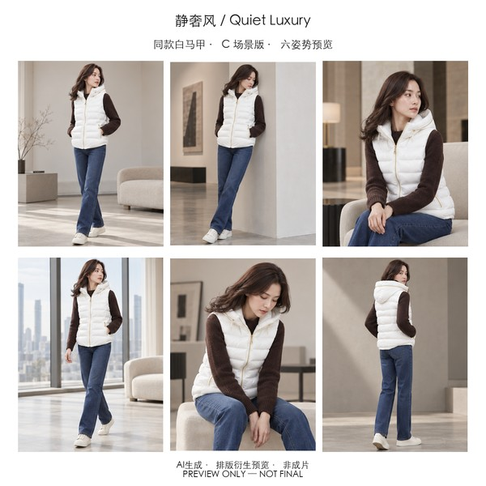</a><br>Quiet Luxury | <a href="docs/demo/style-previews/white-vest-24-v1/resort-vacation-display.jpg">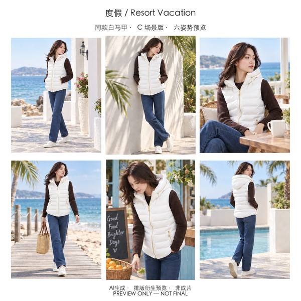</a><br>Resort Vacation | <a href="docs/demo/style-previews/white-vest-24-v1/workwear-vintage-display.jpg">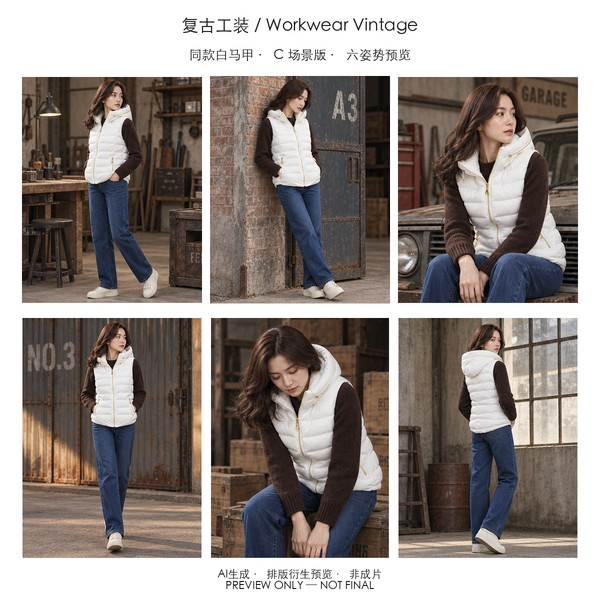</a><br>Workwear Vintage | <a href="docs/demo/style-previews/white-vest-24-v1/y2k-millennium-display.jpg">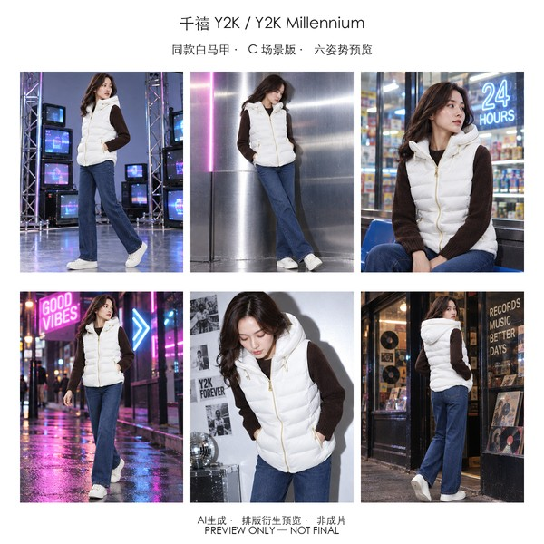</a><br>Y2K Millennium |

<!-- STYLE_PREVIEWS:END -->

## Why it exists and its boundaries

The uploaded garment or locked coordinated outfit remains authoritative for color, material appearance, silhouette, length, construction, pattern, logo placement, and accessories. For a complete outfit, the same rule also covers every included item, layering, proportions, and visible shoe/bag/accessory relationships. Style changes treatment, never product facts or styling. The workflow adds a real-garment input gate, deterministic style routing, a separate paid-generation consent gate, serial six-image delivery, identity anchoring, canvas checks, and evidence-backed QA.

Use it for apparel portraits, fashion editorial, and ecommerce portrait sets. Do not use it for non-apparel products, text-only concept generation, general virtual try-on, CAD-grade fit simulation, API integration, or unattended commercial delivery. It does not promise exact small text/logo reproduction, platform approval, or sales performance.

There is no runtime telemetry, MCP server, external connector, API-key flow, or network fallback. Native image generation is used only after explicit approval. Without that host capability, recognition and prompt work can continue, but generation stops at `tool-blocked`.

## Release and compatibility status

The public Beta began with [`v1.0.0-beta.1`](https://github.com/2278091160dg-rgb/threadtruth-studio/releases/tag/v1.0.0-beta.1). [`v1.0.0-beta.4`](https://github.com/2278091160dg-rgb/threadtruth-studio/releases/tag/v1.0.0-beta.4) is the newest public download; it adds the accepted coordinated-outfit 24-style preview gallery without changing runtime behavior. Audited host: macOS `26.6.2`, `codex-cli 0.144.1`. Codex desktop build: unavailable, not inferred. See [compatibility](docs/COMPATIBILITY.md) and the [30-day Beta register](docs/BETA.md).

The project's own exit targets are at least 30 days, five non-maintainer installations, and three authorized complete cases; these are project targets, not OpenAI admission rules. Codex for Open Source application details live only in [docs/CODEX-FOR-OSS.md](docs/CODEX-FOR-OSS.md).

## Development

```bash
python3 -m unittest discover -s tests -v
python3 tools/pack-lint.py --strict skills/threadtruth-studio/references/styles/*.pack.yaml
python3 tools/trigger-eval.py
python3 tools/build-release.py
```

Runtime lives under `skills/threadtruth-studio/`; repository tests, evals, release tooling, and evidence stay outside it. Read [CONTRIBUTING.md](CONTRIBUTING.md), [SECURITY.md](SECURITY.md), [USER-GUIDE.html](USER-GUIDE.html), [MIGRATION.md](MIGRATION.md), and [PROVENANCE.md](PROVENANCE.md). Apache-2.0 covers code and documentation, not demo media.
